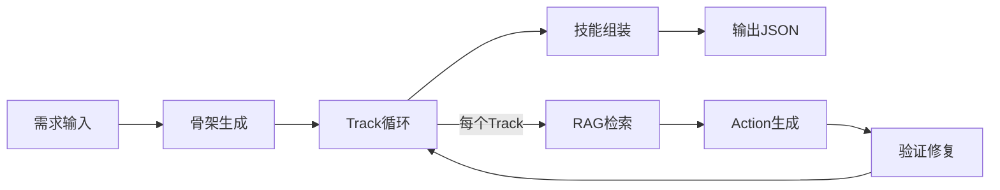
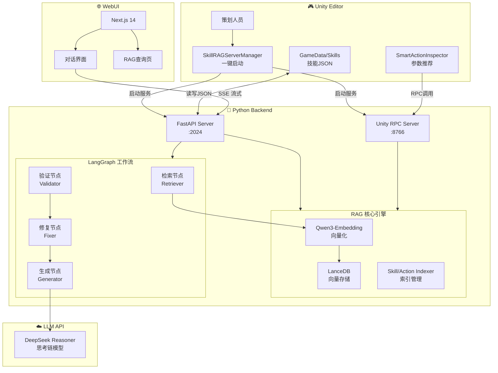
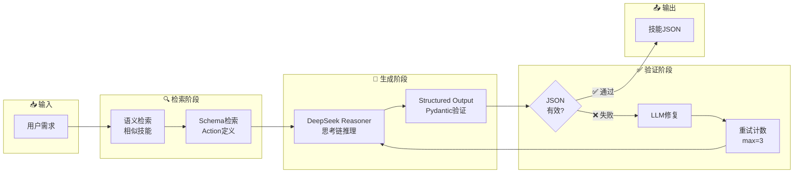
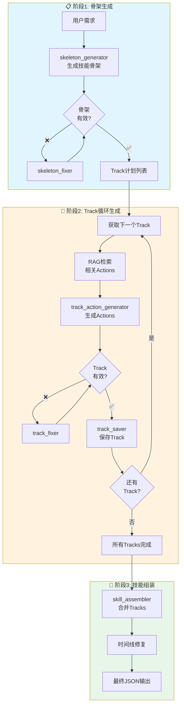
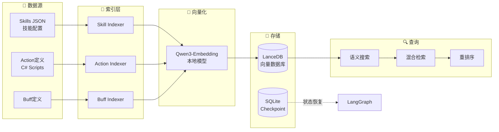
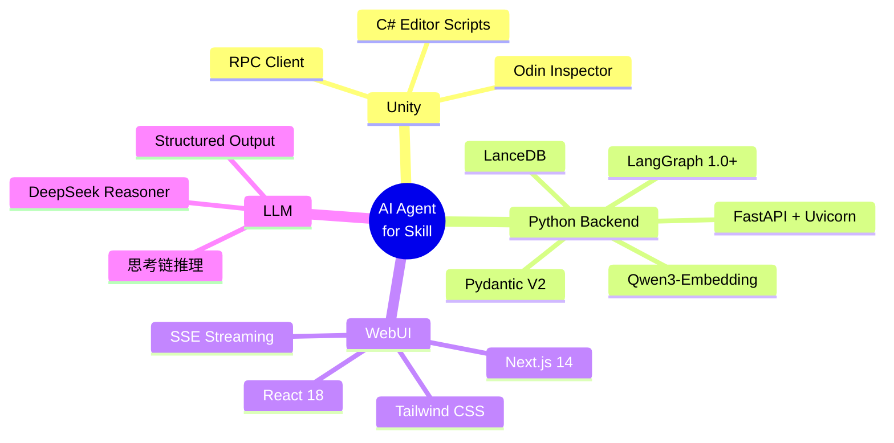
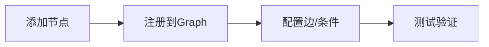
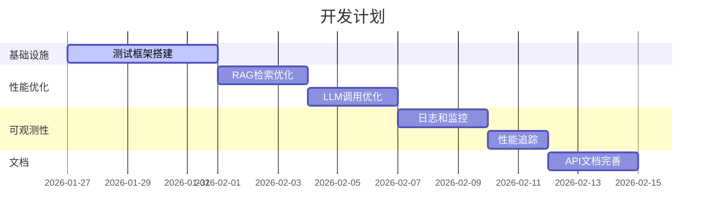

# AI Agent for Skill - Unity技能配置智能助手

> **🎉 v2.1.0 更新**: 渐进式生成流式输出优化！支持三阶段生成 + 实时思考过程展示


## 📖 项目简介

本项目是一个**Unity技能配置智能助手系统**，通过 **RAG (检索增强生成) + LangGraph 工作流**，实现技能配置的智能分析、自动修复和快速生成。

```
🎯 策划输入需求 → 🔍 RAG检索相似技能 → 🤖 AI生成配置 → ✅ 自动验证修复 → 📄 输出JSON
```

### ✨ 核心特性

| 特性 | 说明 |
|------|------|
| 🚀 **一键启动** | Unity菜单 `Tools/SkillAgent/启动服务器` 直接拉起所有服务 |
| 💬 **对话式交互** | 自然语言描述需求即可生成技能配置 |
| 🧠 **智能参数推荐** | Unity Inspector中自动推荐Action参数 |
| 🔍 **语义检索** | 基于向量相似度快速查找相关技能 |
| 🔧 **自动修复** | LangGraph工作流自动验证和修复JSON错误 |
| 🔒 **本地部署** | Qwen3-Embedding本地运行，数据不出本地 |

---

## 🚀 快速开始

### 环境依赖

#### Python环境
```bash
Python >= 3.10
依赖包: requirements.txt
```

本项目使用 LanceDB 嵌入式向量数据库，无需 Docker。

#### API Key配置
在 `skill_agent/.env` 文件中配置（如不存在请创建）:
```bash
# DeepSeek API Key（必需）
DEEPSEEK_API_KEY=your-deepseek-api-key
```

**重要说明**：
- 默认使用 `deepseek-reasoner` 模型（具备思考链能力）
- reasoner 模型需要较长推理时间（3-15秒），请调整超时配置
- 推荐配置：`temperature=1.0`, `timeout=120s`
- 向量数据库使用 LanceDB（嵌入式，无需 Docker）

### 一键启动 (推荐方式)

**从Unity编辑器启动**:
1. 在Unity中打开项目 `ai_agent_for_skill/`
2. 菜单栏选择 `Tools/SkillAgent/启动服务器`
3. 等待服务启动,会自动打开浏览器访问 `http://localhost:7860`

**手动启动**:
```bash
REM 推荐：使用根目录 launch.bat
launch.bat full

# 或分别启动
REM 仅后端
launch.bat server

REM 仅前端（需要确保后端已启动）
launch.bat webui

# 或手动运行（开发用）
python langgraph_server.py  # 启动LangGraph服务 (端口2024)
cd ../webui && npm run dev   # 启动Web UI (端口7860)
```

### 验证服务状态

在Unity菜单选择 `Tools/SkillAgent/检查服务器状态`,或访问:
- LangGraph服务健康检查: `http://localhost:2024/health`
- Web UI: `http://localhost:7860`（或 `http://localhost:3000`，取决于启动方式）

**端口说明**：
- `2024`: LangGraph HTTP Server（技能生成/搜索 API）
- `7860`: WebUI 默认端口（Gradio 默认）
- `8766`: Unity RPC Server（Unity Inspector 参数推荐）

---

## 💡 使用指南

### 技能生成模式

| 模式 | Assistant ID | 适用场景 |
|------|-------------|---------|
| **一次性生成** | `skill-generation` | 简单技能，速度快 |
| **渐进式生成** 🔥 | `progressive-skill-generation` | 复杂技能，分阶段生成 |

**对话示例**:
```
你: 生成一个火球术技能，造成100点火焰伤害，并击退敌人3米

AI: 🔍 检索相似技能 → 🤖 生成配置 → ✅ 验证JSON → 📄 返回完整配置
```

### 渐进式生成流程 (推荐)



**优势**: Token消耗↓30% | 错误隔离 | 进度可见 | 实时思考展示

### 其他功能

| 功能 | 入口 | 说明 |
|------|------|------|
| 技能搜索 | WebUI RAG页面 | 语义检索相似技能 |
| 参数推荐 | Unity Inspector | 右键 → 智能推荐参数 |
| 自动修复 | 自动触发 | 验证失败自动修复(最多3次) |

---

## 🏗️ 项目架构

### 系统总览



### 技能生成工作流

#### 一次性生成模式 (`skill-generation`)



#### 渐进式生成模式 (`progressive-skill-generation`) 🔥推荐



### 数据流架构



### 目录结构

```
ai_agent_for_skill/
├── 📦 ai_agent_for_skill/       # Unity项目
│   └── Assets/
│       ├── Scripts/
│       │   ├── SkillSystem/     # 21种Action类型定义
│       │   └── RAGSystem/       # Unity集成
│       │       └── Editor/      # 编辑器脚本
│       └── GameData/Skills/     # 技能JSON配置
│
├── 🐍 skill_agent/              # Python后端
│   ├── core/                    # RAG核心引擎
│   │   ├── embeddings.py        # Qwen3向量生成
│   │   ├── vector_store.py      # LanceDB封装
│   │   └── *_indexer.py         # 索引器
│   ├── orchestration/           # LangGraph编排层
│   │   ├── graphs/              # 工作流定义
│   │   ├── nodes/               # 节点实现
│   │   ├── schemas.py           # Pydantic Schema
│   │   └── prompts/             # Prompt模板
│   ├── Data/                    # 数据目录
│   │   ├── models/              # 本地Embedding模型
│   │   └── checkpoints/         # 状态持久化
│   └── langgraph_server.py      # FastAPI入口
│
└── 🌐 webui/                    # Next.js前端
    └── src/
        ├── app/                 # App Router
        ├── components/          # React组件
        └── providers/           # 状态管理
```

### 技术栈



### 服务端口

| 服务 | 端口 | 协议 | 说明 |
|------|------|------|------|
| LangGraph Server | `2024` | HTTP/SSE | 技能生成/搜索API |
| WebUI | `7860` | HTTP | Next.js前端 |
| Unity RPC | `8766` | JSON-RPC | Inspector参数推荐 |

---

## ⚙️ 配置说明

### 核心配置文件

| 文件 | 说明 |
|------|------|
| `skill_agent/.env` | API密钥配置 (DEEPSEEK_API_KEY) |
| `skill_agent/core_config.yaml` | RAG引擎配置 |
| `webui/.env` | 前端环境配置 |

### RAG配置 (`core_config.yaml`)

```yaml
embedding:
  model_name: "Qwen/Qwen3-0.6B-Embedding"
  model_path: "./Data/models/Qwen3-0.6B-Embedding"
  device: "cuda"  # 或 "cpu"

vector_store:
  type: "lancedb"
  lancedb_path: "./Data/lancedb"

skill_indexer:
  skills_directory: "../ai_agent_for_skill/Assets/GameData/Skills"
  auto_reload: true
```

### LLM配置

```python
# DeepSeek Reasoner 推荐配置
LLM_CONFIG = {
    "model": "deepseek-reasoner",  # 思考链模型
    "temperature": 1.0,            # reasoner 固定值
    "timeout": 120,                # 推理时间较长(3-15s)
}
```

---

## 🛠️ 开发指南

### 扩展工作流



**示例: 添加平衡性检查节点**

```python
# 1. 在 nodes/skill_nodes.py 定义节点
def balance_check_node(state):
    skill = json.loads(state["generated_json"])
    # 检查逻辑...
    return {"balance_warnings": warnings}

# 2. 在 graphs/skill_generation.py 注册
workflow.add_node("balance_check", balance_check_node)
workflow.add_edge("validate", "balance_check")
```

### 添加新Action类型

1. **Unity**: `Assets/Scripts/SkillSystem/Actions/YourAction.cs`
2. **索引**: `skill_agent/core/action_indexer.py` 注册
3. **重建**: `python rebuild_index.py`

---

## ❓ 常见问题

<details>
<summary><b>Q1: 启动服务失败</b></summary>

**检查清单**:
1. `pip install -r requirements.txt` 安装依赖
2. 配置 `DEEPSEEK_API_KEY` 环境变量
3. 检查端口占用: `netstat -ano | findstr :2024`
4. 确认模型文件: `skill_agent/Data/models/Qwen3-Embedding-0.6B/`
</details>

<details>
<summary><b>Q2: 生成结果不符合预期</b></summary>

- 提供更详细的需求描述（效果、数值、特效类型）
- 增加 `top_k` 检索更多相似技能
- 自定义 `prompts.yaml` 中的 Prompt 模板
</details>

<details>
<summary><b>Q3: Reasoner 推理时间过长 (3-15s)</b></summary>

这是正常现象。DeepSeek Reasoner 会先进行思考链推理，然后生成结果。
如需加速可使用 `deepseek-chat` 模型（但质量降低）。
</details>

<details>
<summary><b>Q4: 向量检索不准确</b></summary>

1. 重建索引: `python rebuild_index.py --force`
2. 增加技能描述的语义信息 (description字段)
</details>

---

## 📊 性能指标

| 指标 | 数值 |
|------|------|
| 向量检索延迟 | <100ms |
| 端到端生成 | 5-15s |
| 一次通过率 | 85%+ |
| 修复成功率 | 98%+ |
| Embedding 内存 | ~2GB (GPU) / ~1GB (CPU) |

---

## 📅 版本历史

### v2.1.0 (当前)
- ✅ 渐进式生成（骨架→Track→组装）
- ✅ 流式思考输出优化
- ✅ SQLite 状态持久化

### v2.0.0
- ✅ RAG 功能迁移至 WebUI
- ✅ DeepSeek Reasoner 集成
- ✅ Odin 格式 Structured Output

---

## 🗺️ 开发路线图



**长期规划**:
- 🎨 多模态支持（动画/特效预览）
- 📦 批量生成技能族群
- 🏢 多租户 & RBAC
- 🤖 Multi-Agent 协作

---

## 📚 关键文件速查

| 功能 | 文件路径 |
|------|----------|
| Unity启动 | `ai_agent_for_skill/Assets/Scripts/RAGSystem/Editor/SkillRAGServerManager.cs` |
| LangGraph服务 | `skill_agent/langgraph_server.py` |
| 技能生成工作流 | `skill_agent/orchestration/graphs/skill_generation.py` |
| 渐进式生成 | `skill_agent/orchestration/graphs/progressive_skill_generation.py` |
| Pydantic Schema | `skill_agent/orchestration/schemas.py` |
| Prompt模板 | `skill_agent/orchestration/prompts/prompts.yaml` |
| 流式输出 | `webui/src/providers/Stream.tsx` |

---

## 📜 许可证

本项目仅供学习和研究使用。
