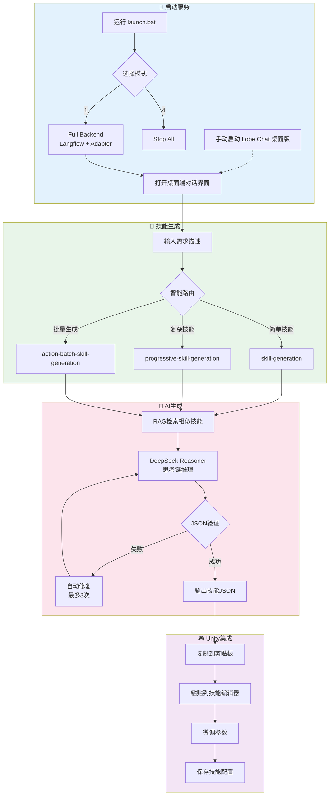
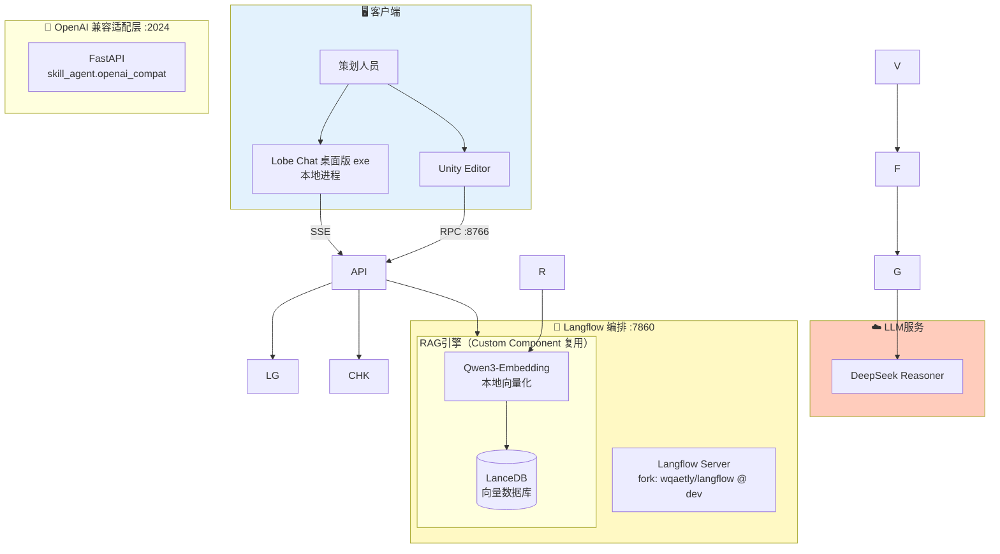
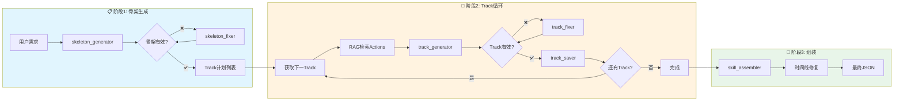
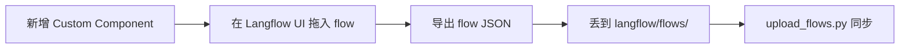

# AI Agent for Skill - Unity技能配置智能助手

> **🎉 v3.0.0-langflow-lobechat 更新** (2026-05): 后端编排切换到 [wqaetly/langflow @ dev](https://github.com/wqaetly/langflow/tree/dev) fork（本地 `uv` 运行、无 Docker），前端切换到 [Lobe Chat](https://github.com/lobehub/lobe-chat) **桌面版 exe**（由使用者自行下载安装，仓库不再提供部署资产）；LangGraph 与自研 WebUI 已退场。完整迁移说明见 [`MIGRATION.md`](./MIGRATION.md)。


## 📖 项目简介

本项目是一个 **Unity 技能配置智能助手系统**，通过 **RAG (检索增强生成) + Langflow 可视化编排 + Lobe Chat**，实现技能配置的智能分析、自动修复和快速生成。

```
🎯 策划输入需求 → 🔍 RAG检索相似技能 → 🤖 Langflow flow 生成配置 → ✅ 自动验证修复 → 📄 输出JSON
```

运行拓扑：Lobe Chat（桌面 exe，用户自启）→ OpenAI 兼容适配层 :2024 → Langflow fork :7860 → Unity RPC :8766。

### 📊 项目状态 (v3.0)

| 组件 | 状态 | 说明 |
|------|:----:|------|
| Langflow 后端 | ✅ | 基于 fork 本地源码运行（`uv run langflow run`）@7860，无 Docker |
| OpenAI 兼容适配层 | ✅ | FastAPI @2024，将 OpenAI Chat Completions 转发为 Langflow Run API |
| Lobe Chat 前端 | 🔗 | **桌面版 exe**，从 [lobehub.com](https://lobehub.com/) 下载后手动配置指向适配层（详见下文 *Lobe Chat 桌面版配置指南*） |
| Unity 集成 | ✅ | 技能编辑器 + 21 种 Action；RPC @8766 协议未变 |
| 启动脚本 | ✅ | `launch.bat` v3 菜单（Backend / Stop）；不再启动前端 |

### ✨ 核心特性

| 特性 | 说明 |
|------|------|
| 🚀 **一键启动** | `launch.bat` 或 Unity菜单直接拉起所有服务 |
| 💬 **Lobe Chat 交互** | 提供思考链折叠、JSON 高亮与一键复制，无需二次开发 |
| 🧠 **智能路由** | `smart` model 自动选择最佳生成策略 (检索 / 一次性 / 渐进式 / 批次) |
| 🔍 **语义检索** | 基于向量相似度快速查找相关技能 |
| 🔧 **可视化编排** | Langflow Playground 中可拖拽调试 flow，看到阶段进度 |
| 🔒 **本地部署** | Qwen3-Embedding 本地运行，LLM 调用除外所有数据不出本地 |

---

## 🚀 快速开始

### 使用流程概览

```mermaid
flowchart LR
    subgraph 启动["1️⃣ 启动服务"]
        A[运行 launch.bat] --> B{选择菜单}
        B -->|1 Backend| C[Langflow + Adapter]
        B -->|4 Stop|   X[停止所有后端]
        Z[手动启动 Lobe Chat 桌面版 exe] -.首次设置后绿色连通.-> C
    end

    subgraph 使用["2️⃣ 使用系统"]
        F[打开 Lobe Chat 桌面端] --> G[选择 model<br/>(progressive / smart / search…)]
        G --> H[输入需求描述]
        H --> I[查看思考链 + 复制 JSON]
    end

    subgraph Unity["3️⃣ Unity 集成"]
        I --> J[导入技能编辑器]
        J --> K[调整参数]
        K --> L[保存使用]
    end

    C --> F
```

### 环境依赖

| 依赖 | 版本要求 | 说明 |
|------|---------|------|
| Python | >= 3.10 | 适配层运行环境 |
| [uv](https://docs.astral.sh/uv/) | latest | Langflow fork 本地启动依赖；`pip install uv` 或 `winget install astral-sh.uv` |
| Lobe Chat 桌面版 | latest | 从 [lobehub.com](https://lobehub.com/) 下载 Windows / macOS 安装包后手动启动 |
| DeepSeek API | - | 需要配置 API Key |
| `external/langflow` submodule | dev | 首次 clone 后运行 `git submodule update --init --recursive` |

> 本仓库全栈已去 Docker 化。Langflow 本地 `uv run` 运行；Lobe Chat 使用官方桌面版 exe，**不再提供什么 docker-compose / 容器镜像**。

### 一键启动 (推荐)

```bash
# 首次运行：拉取子模块
 git submodule update --init --recursive

# 启动菜单
launch.bat

# v3.0 菜单（仅后端）：
# [1] Full Backend (Langflow + Adapter)   ← 推荐
# [2] Backend Only                        ← [1] 的别名，向后兼容
# [4] Stop All Services
# [0] Exit
```

**首次启动会自动**：
- 创建 Python 虚拟环环境与安装依赖（`requirements.txt`）
- 提示配置 `DEEPSEEK_API_KEY`、下载 Qwen3-Embedding 模型（~1.2GB）
- 首次 `[1]` 会触发 `uv sync` 在 `external/langflow` 下生成 `.venv`（首次 5–10 分钟，后续秒级）

**首次启动后手动补两步**：
1. 在 Langflow ready 后执行 `python langflow\scripts\upload_flows.py` 将 `langflow/flows/*.json` 导入运行中的 Langflow。
2. 启动 Lobe Chat 桌面端 exe，照 [下文 *Lobe Chat 桌面版配置指南*](#-lobe-chat-桌面版配置指南) 填入一次供应商设置（之后会在本地持久化，不需重复填写）。

### 服务端口

| 服务 | 端口 | URL |
|------|------|-----|
| Langflow Playground | 7860 | http://localhost:7860 |
| OpenAI 兼容适配层 | 2024 | http://localhost:2024/v1/models · health 在 `/health` |
| Lobe Chat 桌面版 | 本地进程 | 启动后在桌面端设置中调起，无需端口 |
| Unity RPC | 8766 | TCP socket，Unity Editor 内部使用 |

### 验证服务

```bash
# 健康检查
curl http://localhost:2024/health

# 或访问 API 文档
http://localhost:2024/docs
```

---

## 💬 Lobe Chat 桌面版配置指南

本仓库不再提供 Lobe Chat 的部署脚本。你需要从 [lobehub.com](https://lobehub.com/) 自行下载 **桌面版安装包**（Windows `.exe` / macOS `.dmg`）安装后启动。以下是与本仓库后端对接的一次性设置。

### 1. 添加自定义 OpenAI 供应商

桌面端 → **设置 → 语言模型 → OpenAI**，填写：

| 字段 | 值 |
|------|-----|
| **API 代理地址 (`OPENAI_PROXY_URL`)** | `http://localhost:2024/v1` |
| **API Key (`OPENAI_API_KEY`)** | `skill-agent-local`（适配层不验证，任意非空字串均可） |
| **模型列表 (`OPENAI_MODEL_LIST`)** | 见下方 |
| 其他 | 留默认 |

### 2. 模型列表完整字符串

贴到桌面端的 *模型列表* / *Custom Model Names* 输入框：

```
+progressive-skill-generation,+skill-generation,+action-batch-skill-generation,+skill-search,+skill-detail,+skill-validation,+parameter-inference,+smart
```

每个 model 在 Lobe Chat 中的预期表现：

| Model id | 预期前端表现 |
|----------|--------------|
| `progressive-skill-generation` | 思考链折叠 + 最终 JSON 代码块（含一键复制） |
| `skill-generation` | 思考链折叠（较短） + 最终 JSON 代码块 |
| `action-batch-skill-generation` | 思考链折叠（最长） + 最终 JSON 代码块；适合超复杂技能 |
| `skill-search` | Markdown 表格（无思考链） |
| `skill-detail` | JSON 代码块（无思考链） |
| `skill-validation` | JSON 代码块（含 `validation_errors`、`retry_count`） |
| `parameter-inference` | JSON 代码块（含建议的参数键值对） |
| `smart` | 视路由结果而定，思考链首行打印 `[router] -> <runner_name>` |

### 3. 验证连通

1. 确保 `launch.bat → [1]` 拉起后端，`curl http://localhost:2024/health` 返回 `{"status":"ok"}`。
2. 桌面端新建会话 → 选模型 `progressive-skill-generation` → 输入：`火球术，造成 100 点火焰伤害`。
3. 预期看到：消息上方出现 *Thoughts* 折叠面板（含 `[skeleton_generator]`、`[track_generator]`、`[skill_assembler]` 阶段标记），最终输出为 ` ```json` 围栏代码块。

### 4. 思考链折叠区不显示怎么办

企业版 / 老版 Lobe Chat 可能不识别 `delta.reasoning_content`。回退方案：修改 [`skill_agent/openai_compat/stream_adapter.py`](./skill_agent/openai_compat/stream_adapter.py) 的 `langflow_event_to_chunks`，把 thinking 包装为 `<details><summary>...</summary>...</details>` Markdown 后写入 `delta.content`（详见 [`MIGRATION.md`](./MIGRATION.md) 风险 R3）。

---

## 💡 使用指南

### 技能生成完整流程


```mermaid
flowchart TB
    subgraph Start["🚀 启动服务"]
        A[运行 launch.bat] --> B{选择模式}
        B -->|1| C[Full Backend<br/>Langflow + Adapter]
        B -->|4| E[Stop All]
        F0[手动启动 Lobe Chat 桌面版] -.-> F
    end

    subgraph Usage["💬 技能生成"]
        C --> F[打开桌面端对话界面]
        F --> G[输入需求描述]
        G --> H{智能路由}
        H -->|简单技能| I[skill-generation]
        H -->|复杂技能| J[progressive-skill-generation]
        H -->|批量生成| K[action-batch-skill-generation]
    end

    subgraph Generation["🤖 AI生成"]
        I --> L[RAG检索相似技能]
        J --> L
        K --> L
        L --> M[DeepSeek Reasoner<br/>思考链推理]
        M --> N{JSON验证}
        N -->|失败| O[自动修复<br/>最多3次]
        O --> M
        N -->|成功| P[输出技能JSON]
    end

    subgraph Unity["🎮 Unity集成"]
        P --> Q[复制到剪贴板]
        Q --> R[粘贴到技能编辑器]
        R --> S[微调参数]
        S --> T[保存技能配置]
    end

    style Start fill:#e3f2fd
    style Usage fill:#e8f5e9
    style Generation fill:#fce4ec
    style Unity fill:#f3e5f5
```

### 生成模式对比

| 模式 | Assistant ID | 适用场景 | 优势 |
|------|-------------|---------|------|
| **一次性生成** | `skill-generation` | 简单技能 | 速度快 |
| **渐进式生成** 🔥 | `progressive-skill-generation` | 复杂技能 | Token↓30%、进度可见 |
| **批量生成** | `action-batch-skill-generation` | 多Action技能 | 细粒度控制 |

### 对话示例

```
你: 生成一个火球术技能，造成100点火焰伤害，并击退敌人3米

AI: 🔍 检索相似技能 → 🤖 生成配置 → ✅ 验证JSON → 📄 返回完整配置
```

### 其他功能

| 功能 | 入口 | 说明 |
|------|------|------|
| 技能搜索 | Lobe Chat → 选 `skill-search` model | 语义检索相似技能 |
| 参数推荐 | Unity Inspector | 右键 → 智能推荐参数 |
| 自动修复 | 自动触发 | 验证失败自动修复(最多3次) |

---

## 🏗️ 项目架构

### 系统架构图


```mermaid
flowchart TB
    subgraph Client["🖥️ 客户端"]
        U[策划人员]
        WEB[Lobe Chat 桌面版 exe<br/>本地进程]
        UNITY[Unity Editor]
    end

    subgraph Adapter["🔁 OpenAI 兼容适配层 :2024"]
        ADP[FastAPI<br/>skill_agent.openai_compat]
    end

    subgraph Backend["🧩 Langflow 编排 :7860"]
        LF[Langflow Server<br/>fork: wqaetly/langflow @ dev]

        subgraph RAG["RAG引擎（Custom Component 复用）"]
            EMB[Qwen3-Embedding<br/>本地向量化]
            VEC[(LanceDB<br/>向量数据库)]
        end
    end

    subgraph LLM["☁️ LLM服务"]
        DS[DeepSeek Reasoner]
    end

    U --> WEB
    U --> UNITY
    WEB -->|SSE| API
    UNITY -->|RPC :8766| API

    API --> RAG
    API --> LG
    API --> CHK

    R --> EMB --> VEC
    G --> DS
    V --> F --> G

    style Client fill:#e3f2fd
    style Backend fill:#fff9c4
    style LLM fill:#ffccbc
```

### 渐进式生成工作流 (推荐)


```mermaid
flowchart LR
    subgraph Phase1["📋 阶段1: 骨架生成"]
        direction TB
        A[用户需求] --> B[skeleton_generator]
        B --> C{骨架有效?}
        C -->|❌| D[skeleton_fixer]
        D --> C
        C -->|✅| E[Track计划列表]
    end

    subgraph Phase2["🔄 阶段2: Track循环"]
        direction TB
        F[获取下一Track] --> G[RAG检索Actions]
        G --> H[track_generator]
        H --> I{Track有效?}
        I -->|❌| J[track_fixer]
        J --> I
        I -->|✅| K[track_saver]
        K --> L{还有Track?}
        L -->|是| F
        L -->|否| M[完成]
    end

    subgraph Phase3["🔧 阶段3: 组装"]
        direction TB
        N[skill_assembler] --> O[时间线修复]
        O --> P[最终JSON]
    end

    E --> F
    M --> N

    style Phase1 fill:#e1f5fe
    style Phase2 fill:#fff3e0
    style Phase3 fill:#e8f5e9
```

### 目录结构

```
ai_agent_for_skill/
├── 📦 ai_agent_for_skill/       # Unity项目
│   └── Assets/
│       ├── Scripts/
│       │   ├── SkillSystem/     # 21种Action类型定义
│       │   └── RAGSystem/       # Unity集成
│       │       └── Editor/      # 编辑器脚本
│       └── GameData/Skills/     # 技能JSON配置
│
├── 🐍 skill_agent/              # Python后端
│   ├── core/                    # RAG核心引擎
│   │   ├── embeddings.py        # Qwen3向量生成
│   │   ├── vector_store.py      # LanceDB封装
│   │   └── *_indexer.py         # 索引器
│   ├── orchestration/           # 编排层
│   │   ├── runners/             # 框架无关的纯 Python runner（替代 LangGraph graphs）
│   │   ├── nodes/               # 节点实现
│   │   ├── schemas.py           # Pydantic Schema
│   │   └── prompts/             # Prompt模板
│   ├── Data/                    # 数据目录
│   │   └── models/              # 本地Embedding模型
│   ├── openai_compat/           # OpenAI 兼容适配层 (FastAPI @2024)
│   └── Python/                  # Unity RPC 服务与 Langflow 薄客户端
│
├── 🧩 langflow/                 # Langflow 编排资产
│   ├── components/              # Custom Components 源码
│   ├── flows/                   # 导出的 *.flow.json
│   └── scripts/run_local.bat    # 本地 uv run langflow run 启动脚本
│
└── 📦 external/langflow/        # git submodule → wqaetly/langflow @ dev
```

### 技术栈

| 层级 | 技术 |
|------|------|
| **Unity** | C# Editor Scripts, Odin Inspector |
| **后端** | FastAPI 2024, Langflow fork (uv run) 7860, Pydantic V2 |
| **向量化** | Qwen3-Embedding (本地), LanceDB |
| **前端** | Lobe Chat 桌面版 exe |
| **LLM** | DeepSeek Reasoner (思考链) |

---

## ⚙️ 配置说明

### 核心配置文件

| 文件 | 说明 |
|------|------|
| `skill_agent/.env` | API密钥配置 (DEEPSEEK_API_KEY) |
| `skill_agent/core_config.yaml` | RAG引擎配置 |
| Lobe Chat 桌面端 设置 → OpenAI | 一次性填入 `OPENAI_PROXY_URL=http://localhost:2024/v1`、`OPENAI_API_KEY=skill-agent-local`、模型列表详见上文【Lobe Chat 桌面版配置指南】 |

### RAG配置 (`core_config.yaml`)

```yaml
embedding:
  model_name: "Qwen/Qwen3-0.6B-Embedding"
  model_path: "./Data/models/Qwen3-0.6B-Embedding"
  device: "cuda"  # 或 "cpu"

vector_store:
  type: "lancedb"
  lancedb_path: "./Data/lancedb"

skill_indexer:
  skills_directory: "../ai_agent_for_skill/Assets/GameData/Skills"
  auto_reload: true
```

### LLM配置

```python
# DeepSeek Reasoner 推荐配置
LLM_CONFIG = {
    "model": "deepseek-reasoner",  # 思考链模型
    "temperature": 1.0,            # reasoner 固定值
    "timeout": 120,                # 推理时间较长(3-15s)
}
```

---

## 🛠️ 开发指南

### 扩展工作流


```mermaid
flowchart LR
    A[新增 Custom Component] --> B[在 Langflow UI 拖入 flow]
    B --> C[导出 flow JSON]
    C --> D[丢到 langflow/flows/]
    D --> E[upload_flows.py 同步]
```

**示例: 新增一个 Component**

```python
# 1. 在 langflow/components/ 下新建 YourComponent.py
from langflow.custom import Component
from langflow.io import StrInput, Output

class YourBalanceChecker(Component):
    display_name = "Balance Checker"
    inputs = [StrInput(name="skill_json", display_name="Skill JSON")]
    outputs = [Output(display_name="Warnings", name="warnings", method="check")]

    def check(self) -> dict:
        # 检查逻辑...
        return {"balance_warnings": []}

# 2. 在 Langflow Playground 中拖入该 Component、连边、导出 flow JSON、丢到 langflow/flows/。
```

### 添加新Action类型

1. **Unity**: `Assets/Scripts/SkillSystem/Actions/YourAction.cs`
2. **索引**: `skill_agent/core/action_indexer.py` 注册
3. **重建**: `python rebuild_index.py`

---

## ❓ 常见问题

<details>
<summary><b>Q1: 启动服务失败</b></summary>

**检查清单**:
1. `pip install -r requirements.txt` 安装依赖
2. 配置 `DEEPSEEK_API_KEY` 环境变量
3. 检查端口占用: `netstat -ano | findstr :2024`
4. 确认模型文件: `skill_agent/Data/models/Qwen3-Embedding-0.6B/`
</details>

<details>
<summary><b>Q2: 生成结果不符合预期</b></summary>

- 提供更详细的需求描述（效果、数值、特效类型）
- 增加 `top_k` 检索更多相似技能
- 自定义 `prompts.yaml` 中的 Prompt 模板
</details>

<details>
<summary><b>Q3: Reasoner 推理时间过长 (3-15s)</b></summary>

这是正常现象。DeepSeek Reasoner 会先进行思考链推理，然后生成结果。
如需加速可使用 `deepseek-chat` 模型（但质量降低）。
</details>

<details>
<summary><b>Q4: 向量检索不准确</b></summary>

1. 重建索引: `python rebuild_index.py --force`
2. 增加技能描述的语义信息 (description字段)
</details>

---

## 📊 性能指标

| 指标 | 数值 |
|------|------|
| 向量检索延迟 | <100ms |
| 端到端生成 | 5-15s |
| 一次通过率 | 85%+ |
| 修复成功率 | 98%+ |
| Embedding 内存 | ~2GB (GPU) / ~1GB (CPU) |

---

## 📅 版本历史

| 版本 | 日期 | 主要更新 |
|------|------|----------|
| **v3.0.0-langflow-lobechat** | 2026-05 | 切换到 Langflow + Lobe Chat，移除 LangGraph 与自研 WebUI |
| v2.2.0 | 2026-02 | 项目评估与文档更新、使用流程完善 |
| v2.1.0 | 2026-01 | 渐进式生成、流式思考输出、SQLite状态持久化 |
| v2.0.0 | - | RAG迁移至自研 WebUI、DeepSeek Reasoner集成 |

---

## 📚 关键文件速查

| 功能 | 文件路径 |
|------|----------|
| 后端启动脚本 | `launch.bat` · `langflow/scripts/run_local.bat` |
| OpenAI 兼容适配层 | `skill_agent/openai_compat/server.py` |
| Langflow Custom Components | `langflow/components/*.py` |
| Langflow flow 导入器 | `langflow/scripts/upload_flows.py` |
| 纯 Python runner | `skill_agent/orchestration/runners/` |
| Prompt模板 | `skill_agent/orchestration/prompts/prompts.yaml` |
| Unity连接启动 | `ai_agent_for_skill/Packages/com.rag.skill-agent/Editor/SkillSystem/SkillAgentServerManager.cs` |

---

## 📜 许可证

本项目仅供学习和研究使用。
