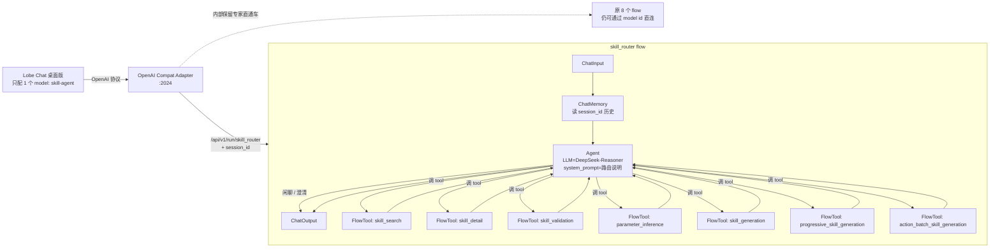

# Skill-Agent Router Flow 设计文档

> **状态**：📐 设计已定稿（2026-05-15），待实施
> **作者**：CodeBuddy + 用户讨论纪要
> **关联文档**：[`README.md`](../README.md)、[`MIGRATION.md`](../MIGRATION.md)、[`langflow/README.md`](../langflow/README.md)

---

## 1. 背景与动机

### 1.1 现状问题

当前 Lobe Chat ↔ Langflow 的协作链路是**有损直连**：

```
Lobe Chat (完整 messages 历史)
    │  OpenAI 协议
    ▼
OpenAI Compat Adapter @ :2024
    │
    │  ⚠️ server.py:158  requirement = req.last_user_text().strip()
    │     只取最后一条 user 文本，丢弃 system / 历史 user / 全部 assistant
    ▼
Langflow @ :7860
    POST /api/v1/run/{flow_id}
    body = {"input_value": "<单条字符串>", "input_type": "chat", "output_type": "chat"}
```

证据链：

| 文件 | 行 | 内容 |
|------|----|------|
| [`skill_agent/openai_compat/server.py`](../skill_agent/openai_compat/server.py) | 158 | `requirement = req.last_user_text().strip()` |
| [`skill_agent/openai_compat/schemas.py`](../skill_agent/openai_compat/schemas.py) | 63–80 | `last_user_text()` 倒序遍历找第一条 `role=="user"` 即返回 |
| [`skill_agent/openai_compat/langflow_client.py`](../skill_agent/openai_compat/langflow_client.py) | `_build_payload` | 仅把 `requirement` 塞进 `input_value`，不传 messages 数组 |
| 8 个生产 flow（`hello_lobe` / `skill_*` / `progressive_*` / `action_batch_*` / `smart_skill_generation`） | — | `ChatInput → LLM → ChatOutput` 直线，无 ChatMemory，看不到历史 |

### 1.2 直接后果

| 用户场景 | 当前能否 work | 原因 |
|----------|---------------|------|
| 第 1 轮：`来个火球术` → 出 JSON | ✅ | 单轮无状态生成 |
| 第 2 轮：`把伤害改成 200` | ❌ | flow 看不到第 1 轮 JSON，"200"无锚点 |
| 第 2 轮：`把刚才那个的火焰改成冰冻` | ❌ | 同上，"刚才那个"对 flow 不可见 |
| 想跟 Langflow 闲聊（`你好`、`这个功能怎么用`） | ⚠️ | 8 个 flow 都会启动完整 RAG + DeepSeek，慢且浪费 tokens |
| Lobe Chat 用户体验 | ⚠️ | 必须在下拉菜单里**手动选 model**（8 个意图各一个），不像 ChatGPT |

### 1.3 期望形态

> 把 Langflow 整体当成一个 LLM——Lobe Chat 那边只看到 **一个 model**，用户想闲聊就闲聊、想生成技能就生成、想改上一轮就改上一轮，**全部交给路由 LLM 自己判断**。

---

## 2. 设计决策（已拍板）

| 编号 | 决策 | 选择 | 说明 |
|------|------|------|------|
| **D1** | 整体方向 | ✅ 单一 router flow + Agent + FlowTool×N | 把现有 8 个特化 flow 包装成 LLM tool，由 router LLM 自己决定调哪个 |
| **D2** | 多轮历史方案 | ✅ Langflow 内置 `ChatMemory` 节点 | 由 flow 内部按 `session_id` 自动读历史，Adapter 不动 messages 解析逻辑 |
| **D3** | Lobe Chat 暴露的 model | ✅ 只对外暴露 `skill-agent` 一个 | 旧 8 个 model id 在 Adapter 内部保留作为"专家直通车"，方便单 flow 调试 / 自动化测试，但 README 不再引导用户填它们 |
| **D4** | `skill-revision` 子 flow | ❌ 暂不实施 | 先观察 Agent 直接基于 ChatMemory + 原生 prompt 能不能改字段；不行再补 |
| **D5** | flow 生成方式 | ✅ 用 Python 代码 dump（沿用既有约定） | 与现存 [`langflow/flows/hello_lobe.py`](../langflow/flows/hello_lobe.py) 风格一致；**禁止**手写 JSON |

---

## 3. 目标架构

### 3.1 整体拓扑



### 3.2 三种典型对话路径

#### 路径 ① 闲聊（短路）
```
用户：你好
Lobe → Adapter → skill_router
    ChatMemory 取空历史
    Agent LLM 判定：闲聊
    Agent 不调任何 tool，直接生成回复
    "你好！我是技能配置助手，可以帮你生成 / 检索 / 验证技能..."
返回给 Lobe
```
**收益**：省掉 RAG 检索 + DeepSeek-Reasoner 长链思考的 5–15 秒延迟与 token 消耗。

#### 路径 ② 全新生成
```
用户：来个火球术，造成 100 点火焰伤害
Agent 判定：生成意图 → 调 FlowTool(progressive_skill_generation, requirement=...)
    progressive_skill_generation 内部走原流程：
        RAG 检索相似技能 → DeepSeek-Reasoner 思考 → 输出 JSON
    返回给 Agent
Agent 整合输出（思考链折叠 + JSON 代码块）
```

#### 路径 ③ 多轮微调（**这次架构升级的核心收益**）
```
轮 1：用户：火球术 100 点伤害      → Agent 调 progressive_skill_generation → 出 JSON_v1
轮 2：用户：把伤害改成 200，加冰冻
    ChatMemory 取出 session 内的 历史 user + 历史 assistant（含 JSON_v1）
    Agent LLM 看到完整上下文：
        - 上一轮 assistant 已生成的 JSON_v1
        - 用户当前需求 "把伤害改成 200，加冰冻"
    Agent 决策（D4 暂未实施 skill_revision flow，先看 Agent 自己能不能改）：
        a) 直接基于 prompt 改写 JSON_v1 → 输出 JSON_v2
        b) 或调 progressive_skill_generation 重生成（fallback）
```

---

## 4. 落地步骤

> **执行顺序**：4.1 → 4.2 → 4.3 → 4.4 → 4.5。先跑通 4.1 + 4.3 的最小闭环（Adapter 改路由表 + 一个空壳 router flow），再陆续接 tool。

### 4.1 新增 `langflow/flows/skill_router.py`

参考 [`langflow/flows/hello_lobe.py`](../langflow/flows/hello_lobe.py) 的代码 dump 风格，构造 router flow：

```text
节点清单：
  - ChatInput
  - ChatMemory（n_messages=20，session_id 自动从 input 透传）
  - Agent（LLM=DeepSeek-Reasoner，tools=[7 个 FlowTool]，system_prompt 见 4.4）
  - ChatOutput

输出文件：langflow/flows/skill_router.flow.json
通过：python langflow/scripts/upload_flows.py 推送到 Langflow
```

**关键技术细节**：

- 使用 langflow 内置 [`FlowToolComponent`](../external/langflow/src/lfx/src/lfx/components/flow_controls/flow_tool.py)：
  ```python
  FlowTool(flow_name="skill_search", tool_name="skill_search",
           tool_description="检索技能库中相似的技能配置...")
  ```
- 使用 langflow 内置 [`RunFlowComponent`](../external/langflow/src/lfx/src/lfx/components/flow_controls/run_flow.py)（如果 FlowTool 在 Agent 路径上不顺手，可降级用 RunFlow）。
- ChatMemory 节点：`session_id` 从 ChatInput 透传，**Adapter 端 `session_id` 已透传给 Langflow**（[`server.py:95-101`](../skill_agent/openai_compat/server.py)），Lobe Chat 自动会带 `user` 字段，二者足以构成稳定 session。

### 4.2 不修改现有 8 个特化 flow

- 保持 [`hello_lobe.py`](../langflow/flows/hello_lobe.py) 等不变。
- 它们将被 `FlowToolComponent` 包装成 tool 调用，外部入参从 ChatInput 转为 tool 参数，Agent 自动适配。

### 4.3 修改 [`skill_agent/openai_compat/server.py`](../skill_agent/openai_compat/server.py) 的 `MODEL_TO_FLOW`

```python
MODEL_TO_FLOW: Dict[str, str] = {
    # ===== 主入口（Lobe Chat 唯一引导用户配置的 model）=====
    "skill-agent": "skill_router",

    # ===== 专家直通车（保留给开发 / 自动化测试，不在 README 引导）=====
    "hello-lobe": "hello_lobe",
    "skill-search": "skill_search",
    "skill-detail": "skill_detail",
    "skill-validation": "skill_validation",
    "parameter-inference": "parameter_inference",
    "skill-generation": "skill_generation",
    "progressive-skill-generation": "progressive_skill_generation",
    "action-batch-skill-generation": "action_batch_skill_generation",
    "smart": "smart_skill_generation",
}
```

**`last_user_text` 不改**——D2 选择了 ChatMemory 方案，Adapter 继续只传当前 user 文本即可，多轮上下文由 Langflow 内的 ChatMemory 节点自治。

### 4.4 `Agent` 的 system_prompt 草案

```text
你是 Skill Agent，一个 Unity 技能配置助手。

可用能力：
  - 闲聊 / 解答关于本系统的使用问题（直接回答，不调工具）
  - skill_search       — 按需求语义检索相似的现有技能
  - skill_detail       — 查询某个技能的完整配置
  - skill_validation   — 校验给定技能 JSON 是否合法
  - parameter_inference — 根据 action 类型推断参数键值
  - skill_generation   — 单轮生成简单技能 JSON
  - progressive_skill_generation — 渐进式生成中等技能（含思考链）
  - action_batch_skill_generation — 复杂技能批量生成

决策规则：
  1. 如果用户在闲聊或问元信息（"你是谁"、"怎么用"），直接回答，禁止调工具。
  2. 如果用户要"修改 / 调整 / 把 xxx 改成 yyy"，且历史里有上一轮生成的 JSON，
     直接基于历史 JSON 改写并输出新 JSON，禁止调生成类 tool 重新生成。
  3. 如果是全新需求，根据复杂度选 skill_generation / progressive_* / action_batch_*。
  4. 如果用户问"有没有类似的"、"找一下"，调 skill_search。
  5. 如果用户给了一段疑似技能 JSON，调 skill_validation。

输出风格：
  - 思考链放在 reasoning_content 字段（DeepSeek-Reasoner 原生）
  - 最终 JSON 用 ```json 围栏代码块包裹
  - 与 Lobe Chat 的折叠面板兼容
```

> 这段 prompt 可以在跑通后迭代；建议把它单独抽到 `langflow/flows/_router_prompt.txt`，方便不重 dump flow 也能改。

### 4.5 修改 [`README.md`](../README.md) 的 Lobe Chat 配置指南

第 128–185 行的 *Lobe Chat 桌面版配置指南*：

| 字段 | 旧值 | 新值 |
|------|------|------|
| 模型列表 | `+progressive-skill-generation,+skill-generation,+action-batch-skill-generation,+skill-search,+skill-detail,+skill-validation,+parameter-inference,+smart` | `+skill-agent` |
| 验证用例 | `progressive-skill-generation` + "火球术..." | `skill-agent` + "你好" → 闲聊；"来个火球术..." → 调工具生成 |

旧 8 个 model id 在文档里以 `<details>` 折叠的"高级 / 调试用法"形式保留，避免普通用户被吓到、又不影响开发者直连。

---

## 5. 验收标准

| 编号 | 用例 | 期望结果 |
|------|------|----------|
| V1 | `skill-agent` model 输入"你好" | <2 s 返回闲聊回复，**不**触发 RAG / DeepSeek-Reasoner 长链 |
| V2 | `skill-agent` 输入"来个火球术，100 点火焰" | Agent 调 `progressive_skill_generation`，思考链 + JSON 正常返回 |
| V3 | V2 之后接着说"把伤害改成 200" | Agent 直接改写上轮 JSON 输出新 JSON_v2，**伤害字段为 200，其他字段保持** |
| V4 | V2 之后说"找一下类似的火属性技能" | Agent 调 `skill_search`，返回 Markdown 表格 |
| V5 | 旧 model id `progressive-skill-generation` 仍能直连工作 | 适配层路由表保留，自动化测试不破坏 |
| V6 | 单次会话 30 轮内 ChatMemory 不丢历史 | session_id 一致情况下，Agent 始终能看到上文 |

V3 是这次架构升级**最核心的收益**——它就是用户最初提的"用户聊天，微调某些技能逻辑"的能力。

---

## 6. 风险与回退

| 风险 | 影响 | 缓解 |
|------|------|------|
| **R1** Agent 调 tool 增加首字节延迟 0.5–1 s | 用户体感变慢 | 闲聊路径不调 tool 不受影响；生成路径本来就是分钟级，这点延迟可忽略 |
| **R2** 7 个 FlowTool 的 schema 占 1–2K prompt tokens | DeepSeek-Reasoner 上下文占用 | 64K 上下文绰绰有余；若紧张可分组路由（先大类后小类）—— 当前不做 |
| **R3** Agent 自行改 JSON 效果不稳（D4 风险） | V3 用例可能不达标 | 回退方案：补 `skill-revision` 子 flow（已在原方案 C 中规划）；只需新增 1 个 flow + 在 system_prompt 加一条规则 |
| **R4** ChatMemory 的 session_id 不稳 | 多轮历史断裂 | Adapter 已在 [`server.py:_resolve_session_id`](../skill_agent/openai_compat/server.py) 做了 metadata.session_id → user 的 fallback；Lobe Chat 桌面版会带稳定 user 字段 |
| **R5** 旧 8 个 model 的 README 引导被移除后用户回退困难 | 学习成本 | 旧 model id 在 Adapter 保留 + README 折叠区保留；MIGRATION.md 加一段说明 |
| **R6** [`RunFlowComponent`](../external/langflow/src/lfx/src/lfx/components/flow_controls/run_flow.py) 标记为 `beta = True` | 上游可能有改动 | fork 是 wqaetly/langflow @ dev，已锁版本；如上游变更，在 fork 侧按需修复；同时保留 `FlowToolComponent` 作为后备路径 |

---

## 7. 未决项 / 后续待办

- [ ] **U1** Agent 用 langflow 内置 `Agent` 组件还是自定义 component？先用内置；如内置不支持 DeepSeek-Reasoner 的 reasoning_content 透传，再自定义。
- [ ] **U2** ChatMemory 的 `n_messages` 取多少？暂定 20，跑起来观察 token 消耗后再调。
- [ ] **U3** FlowTool 失败时的 fallback：当 `skill_search` 返回空时，Agent 是否回退到生成类 tool？由 system_prompt 引导，不在代码层硬编码。
- [ ] **U4** Adapter 健康检查 `/health` 是否需要附带"router flow 是否已上传"的探测？低优先级，先靠 `upload_flows.py` 输出确认。
- [ ] **U5** D4（skill-revision flow）的触发条件：如果 V3 用例在两轮迭代内仍不稳，启动该 flow 实施。

---

## 8. 与既有方案的关系

本设计是对 [对话纪要中 A/B/C 三案](#) 的最终收敛：

| 历史方案 | 本设计的取舍 |
|----------|--------------|
| **A**：Adapter flatten messages → prompt | ❌ 弃用。改由 ChatMemory 在 flow 内取历史，Adapter 保持只传当前 user 文本 |
| **B**：每个 flow 入口加 Memory + 改 8 个 flow | ❌ 弃用。重复成本高，违反"集中管理"偏好 |
| **C**：新增 `skill-revision` flow + smart 路由 | ⏸️ 暂缓（D4）。先看 Agent + ChatMemory 是否够用，不够再补 |
| **本设计**：单一 router flow（Agent + 7 FlowTool + ChatMemory） | ✅ 采纳。最契合"把 Langflow 当一个 LLM 用"的心智模型 |

---

## 9. 实施前置依赖

- [ ] [`run_local.bat`](../langflow/scripts/run_local.bat) 能稳定起 Langflow @ 7860 + Vite @ 3000（已就绪 ✅）
- [ ] [`launch.bat`](../launch.bat) 选 `[1]` 能起 Adapter @ 2024（已就绪 ✅）
- [ ] `upload_flows.py` 工作正常（已就绪 ✅）
- [ ] `external/langflow` 子模块的 [`FlowToolComponent`](../external/langflow/src/lfx/src/lfx/components/flow_controls/flow_tool.py) / [`RunFlowComponent`](../external/langflow/src/lfx/src/lfx/components/flow_controls/run_flow.py) 可用（已确认 ✅）
- [ ] `Agent` 组件可用——**待验证**：在 [http://127.0.0.1:3000](http://127.0.0.1:3000) Playground 拖一个 Agent 节点确认能找到 + 能配 DeepSeek-Reasoner

---

## 10. 变更记录

| 日期 | 变更 |
|------|------|
| 2026-05-15 | 设计定稿（V1）。基于 A/B/C 方案讨论后收敛到"单一 router flow + Agent + FlowTool"。决策 D1–D5 拍板。 |

