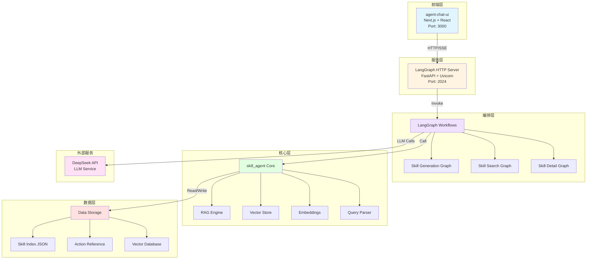
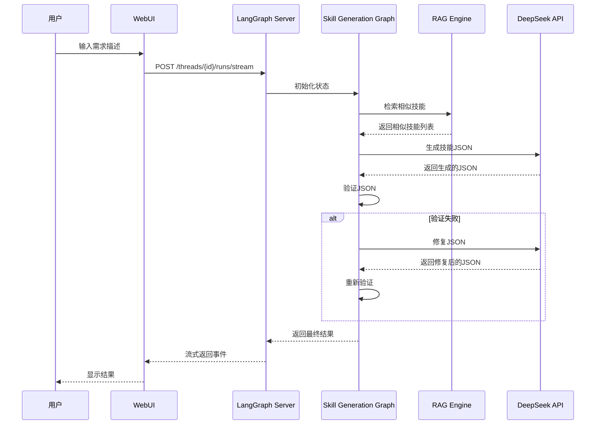
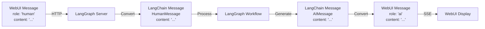

# skill_agent WebUI 架构说明

## 系统架构图



## 数据流

### 1. 技能生成流程



### 2. 消息格式转换



## 技术栈

### 前端 (agent-chat-ui)
- **框架**: Next.js 14 (App Router)
- **UI库**: React + Tailwind CSS
- **状态管理**: React Context
- **通信**: Server-Sent Events (SSE)

### 后端 (LangGraph Server)
- **Web框架**: FastAPI
- **ASGI服务器**: Uvicorn
- **编排引擎**: LangGraph
- **LLM框架**: LangChain

### 核心 (skill_agent)
- **向量存储**: FAISS
- **嵌入模型**: Qwen Embedding
- **查询解析**: 自定义解析器
- **索引**: JSON + Vector Index

## 关键特性

### 1. 流式响应
- 使用 Server-Sent Events (SSE) 实现实时流式输出
- 支持 LangGraph 的 `astream` 异步流式处理
- 前端实时显示生成过程

### 2. 状态管理
- LangGraph 使用 TypedDict 定义状态
- 状态包含 `messages` 字段以兼容 agent-chat-ui
- 支持状态持久化和恢复

### 3. 多助手模式
- **skill-generation**: 技能生成助手
- **skill-search**: 技能搜索助手
- **skill-detail**: 技能详情助手

### 4. 错误处理
- 自动验证生成的 JSON
- 智能修复错误
- 最多重试 3 次
- 详细的错误日志

### 5. RAG 增强
- 语义搜索相似技能
- 基于历史技能生成
- 参数推荐
- 上下文增强

## 部署架构

### 开发环境
```
localhost:3000 (WebUI) ←→ localhost:2024 (LangGraph Server)
```

### 生产环境
```
[Nginx/Caddy]
    ├─→ WebUI (Next.js)
    └─→ LangGraph Server (FastAPI)
         └─→ skill_agent Core
```

## 性能优化

### 1. 缓存策略
- 嵌入向量缓存
- 查询结果缓存
- LLM 响应缓存

### 2. 并发处理
- FastAPI 异步处理
- LangGraph 并行节点
- 连接池管理

### 3. 资源管理
- 模型懒加载
- 内存限制
- 请求超时

## 安全考虑

### 1. API 安全
- CORS 配置
- 请求验证
- 速率限制

### 2. 数据安全
- 环境变量管理
- API 密钥保护
- 输入验证

### 3. 生产部署
- HTTPS 加密
- 身份认证
- 访问控制

## 扩展性

### 1. 水平扩展
- 多个 LangGraph Server 实例
- 负载均衡
- 会话粘性

### 2. 功能扩展
- 添加新的 Graph
- 自定义节点
- 插件系统

### 3. 集成扩展
- Unity 集成
- API 集成
- Webhook 支持
