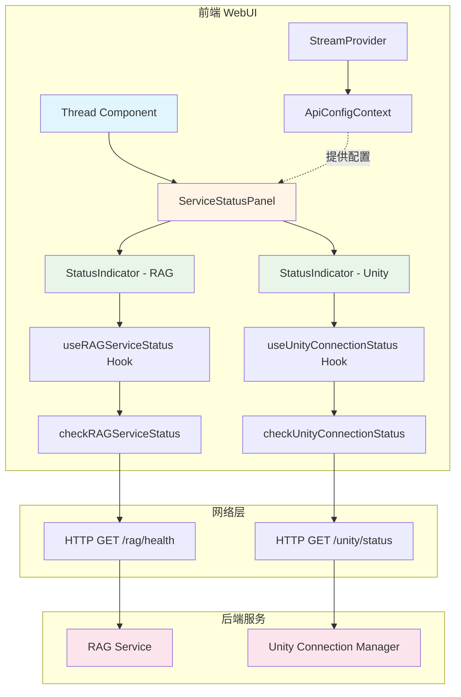
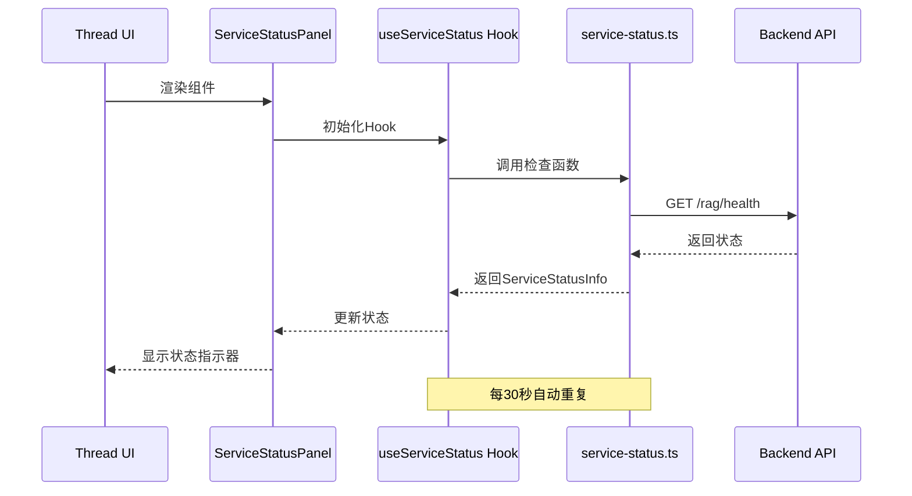
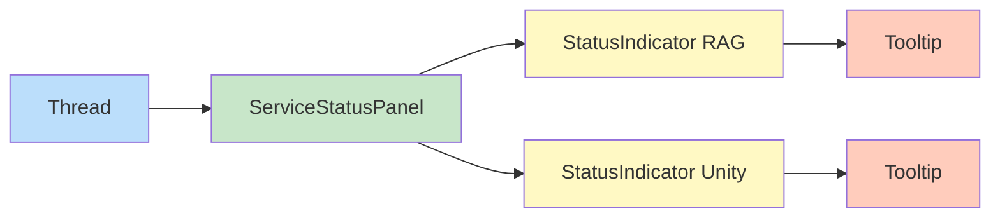
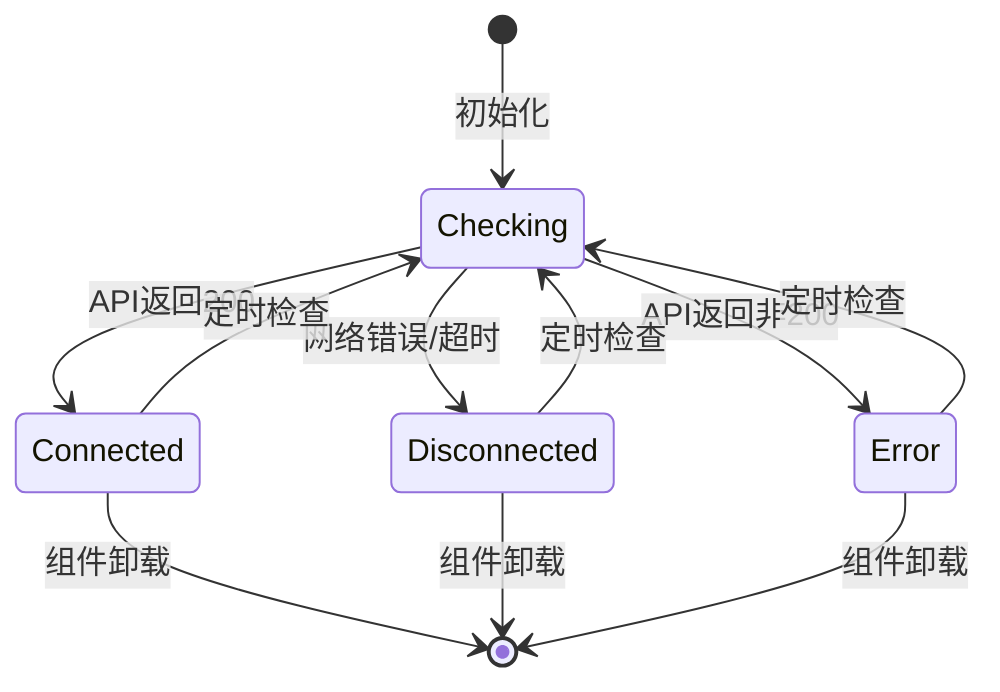
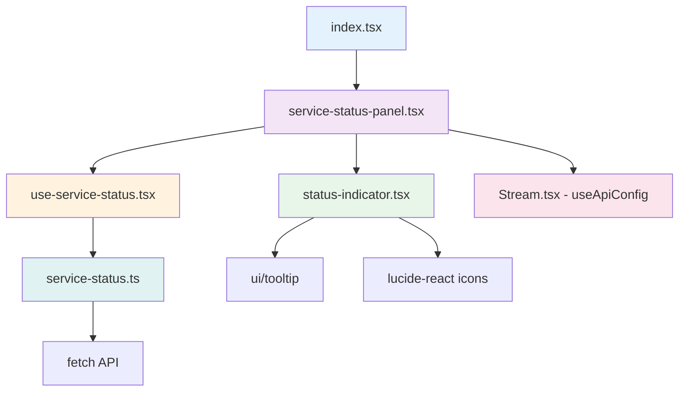
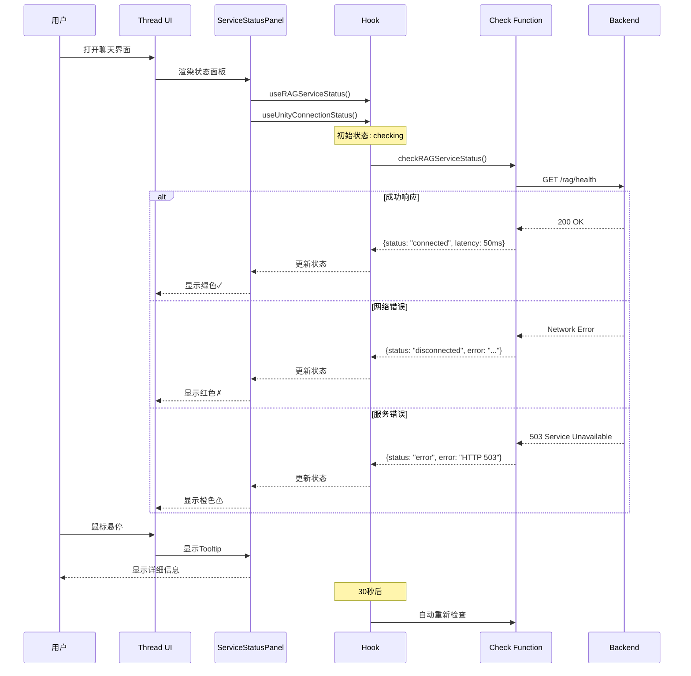
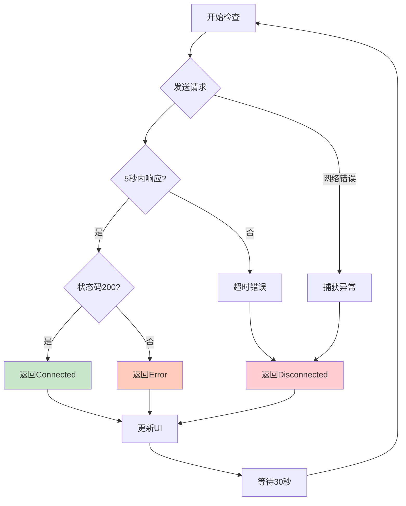
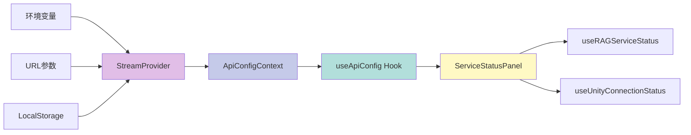
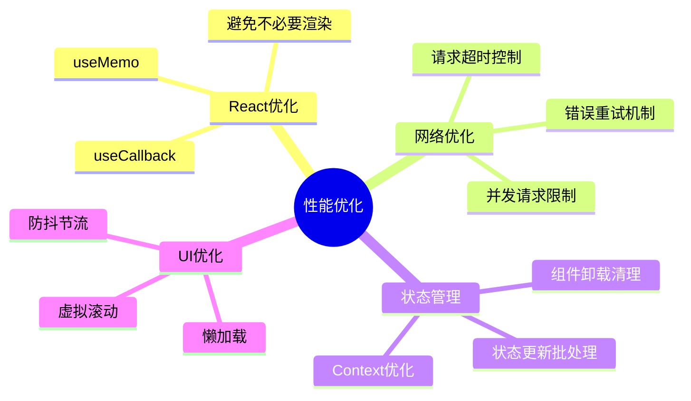
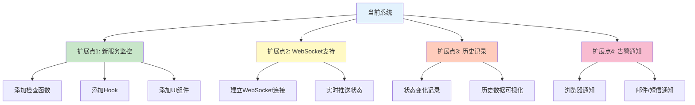

# 服务状态监控 - 架构图

## 系统架构图

## 数据流图

## 组件层次结构

## 状态机图

## 文件依赖关系

## 时序图 - 完整流程

## 错误处理流程

## 配置流程

## 性能优化策略

## 扩展点

## 说明

以上架构图使用Mermaid语法编写，可以在支持Mermaid的Markdown查看器中渲染，例如：
- GitHub
- GitLab
- VS Code (with Mermaid extension)
- Typora
- 在线Mermaid编辑器: https://mermaid.live/

如果您的查看器不支持Mermaid，可以将代码复制到 https://mermaid.live/ 查看渲染效果。
